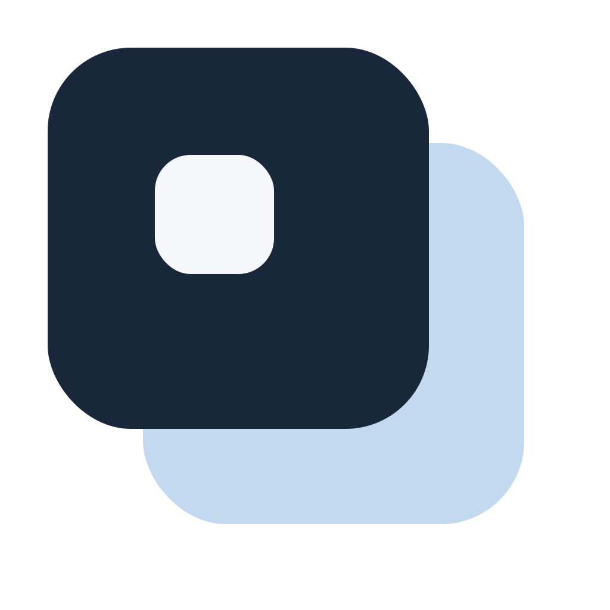
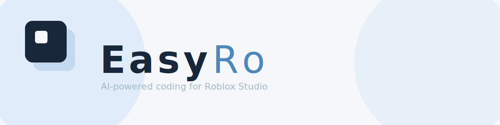

<p align="center">
  
</p>

<p align="center">
  <a href="https://github.com/amagibrilliantpark/EasyRo/releases">
    
  </a>
  <a href="LICENSE">
    
  </a>
</p>



# EasyRo

A desktop app that brings AI-powered agentic coding assistance to Roblox Studio. It connects an AI agent to your project through SyncRo, so the AI can read and write code that syncs directly into Studio.

## What it does

You type what you want in a chat interface. The AI writes Luau code, creates files, and SyncRo pushes those files into Roblox Studio in real time. No copy-pasting, no manual file management.

## How it works

EasyRo runs three things behind the scenes:

- **Electron app** — the UI you interact with
- **OpenCode server** — handles the AI conversations
- **SyncRo** — syncs files between your computer and Roblox Studio

When you send a message, it goes to OpenCode. The AI reads your project files, writes code, and SyncRo picks up the changes and sends them to Studio.

## Requirements

Before using EasyRo, you need:

- **OpenCode CLI** — install with `npm install -g opencode-ai` (requires [Node.js](https://nodejs.org) v18+)
- **Roblox Studio** with the **SyncRo plugin** installed:
  - Open Roblox Studio
  - Go to Toolbox > Plugins
  - Search for "SyncRo" and install it
  - The plugin appears under your Plugins tab

### Using OpenCode

You have two options for the AI backend:

1. **Free models** — OpenCode offers free models out of the box. Just install the CLI and start using it, no API key needed.
2. **Your own API key** — If you have any API key, you can connect it directly from EasyRo: click **Add** in the model selector, pick a provider (or add a custom one), and enter your API key or complete the OAuth flow. No terminal needed.

SyncRo (`syncro.exe`) is included in the project — you don't need to install it separately.

## Usage

1. Open Roblox Studio and load your project
2. Start EasyRo
3. **SyncRo connects automatically** — The SyncRo plugin connects to the server automatically when you open Studio
4. Type what you want in the chat — the AI writes code and SyncRo syncs it to Studio

> **Important:** The SyncRo plugin connects automatically when you open Roblox Studio. No manual connection or port entry is needed.

## Project structure

```
EasyRo/
├── src/                         # Roblox game source
├── desktop-app/                 # Electron desktop application
├── syncro.exe                   # SyncRo binary
├── SyncRo.rbxmx                 # SyncRo plugin
├── default.project.json         # SyncRo project config
├── opencode.json                # OpenCode config
├── AGENTS.md                    # AI behavior instructions
└── .sessions/                   # Session file snapshots
```

## Session isolation

Each AI chat session has its own snapshot of the `src/` directory and config files (`default.project.json`, `opencode.json`, `AGENTS.md`), stored in `.sessions/`. When you switch sessions, the current files are saved and the target session's files are restored. This keeps file changes isolated per session without touching SyncRo or using junctions.

## Platform support

Windows only.

---

## Development

### From source

```bash
cd desktop-app
npm install
npm start
```

### Build

```bash
cd desktop-app
npm run build:win
```

Build output goes to `desktop-app/dist/`.
